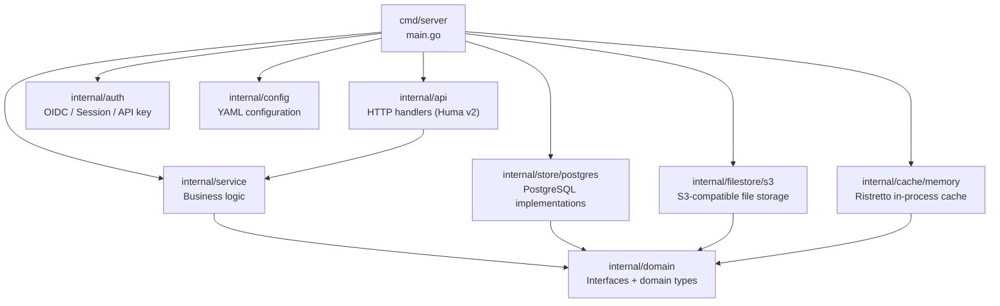
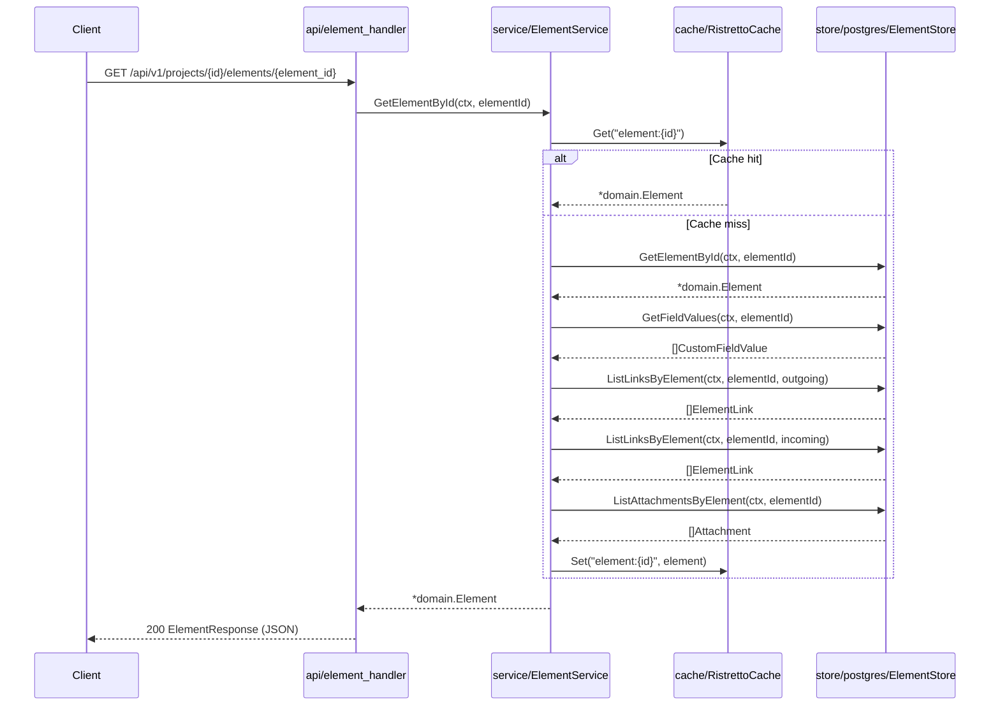
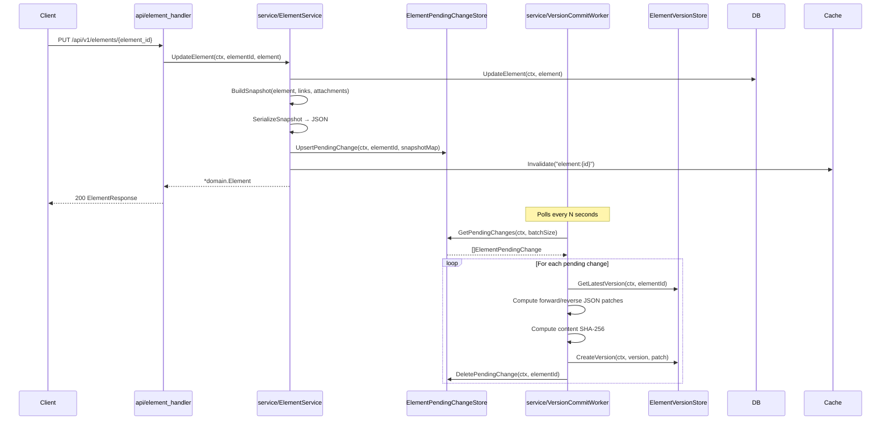
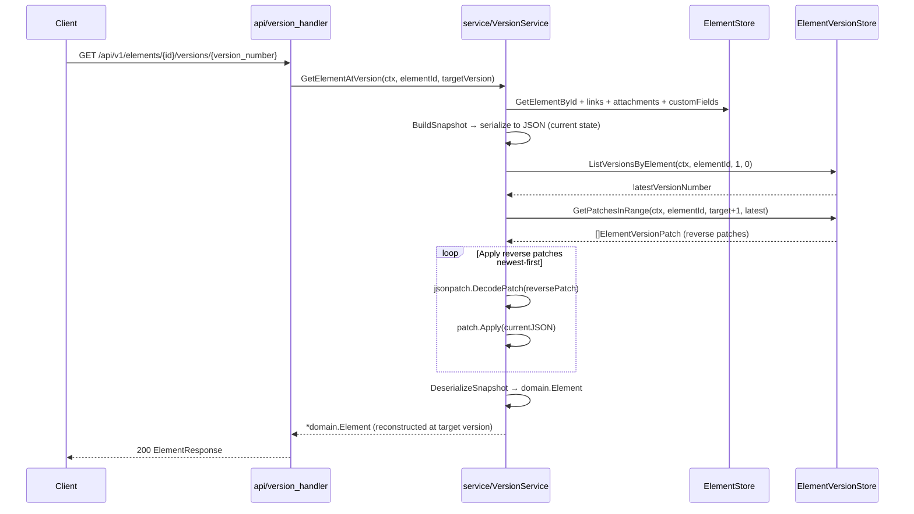
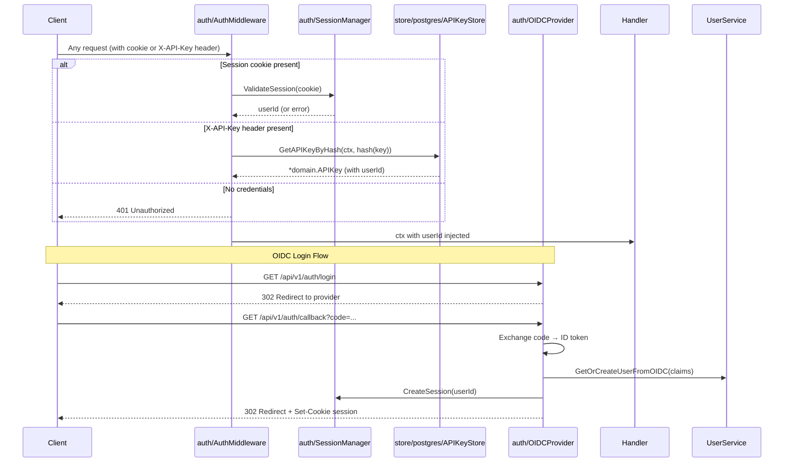
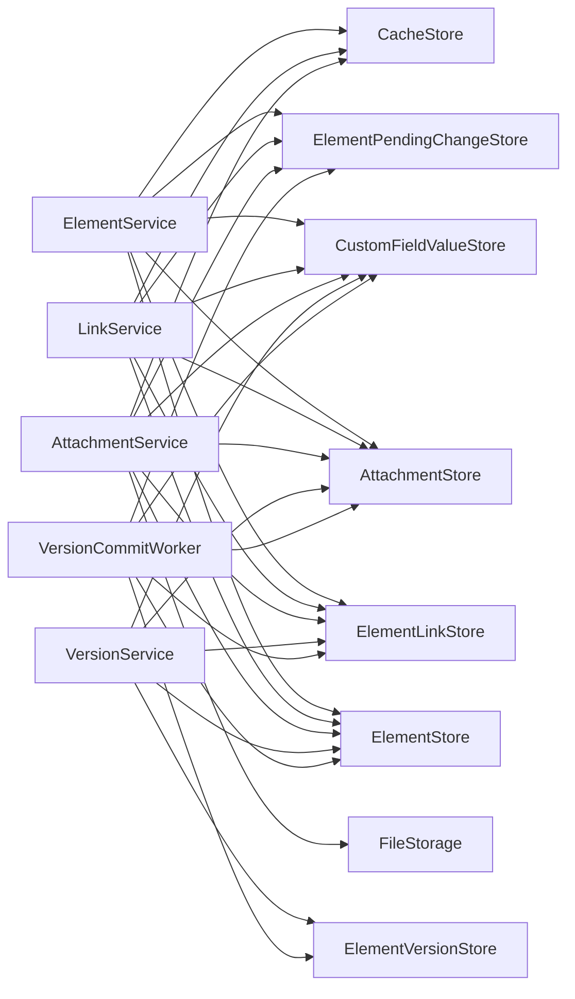
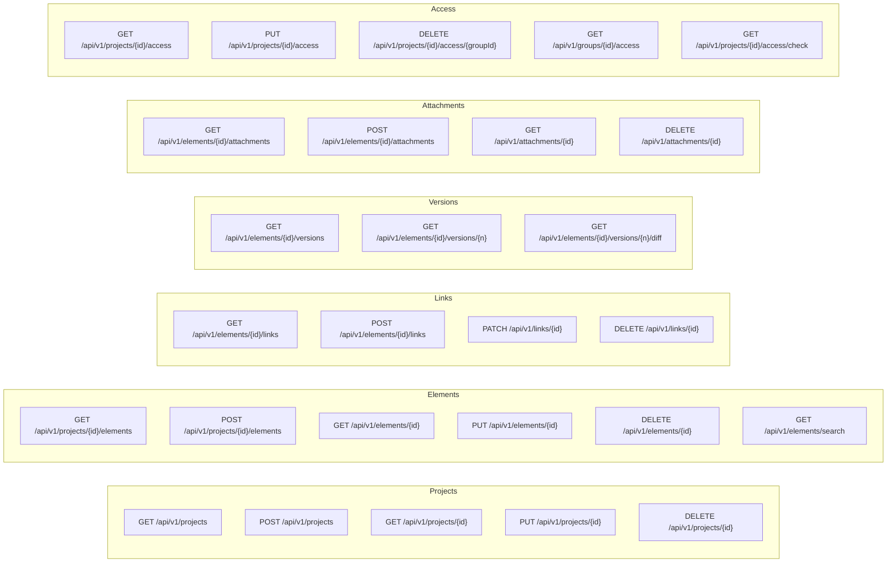

# Backend Architecture Diagrams

## Package Structure

## Domain Interfaces (Dependency Inversion)

```mermaid
classDiagram
    class ElementStore {
        +GetElementById(ctx, elementId) Element
        +ListElementsByProject(ctx, projectId, filter) []Element
        +CreateElement(ctx, element) error
        +UpdateElement(ctx, element) error
        +DeleteElement(ctx, elementId) error
        +SearchElements(ctx, projectId, query, limit, offset) []Element
    }

    class ElementLinkStore {
        +CreateLink(ctx, link) error
        +GetLinkById(ctx, linkId) ElementLink
        +UpdateLinkType(ctx, linkId, linkType) error
        +DeleteLink(ctx, linkId) error
        +ListLinksByElement(ctx, elementId, direction) []ElementLink
    }

    class ElementVersionStore {
        +CreateVersion(ctx, version, patch) error
        +ListVersionsByElement(ctx, elementId, limit, offset) []ElementVersion
        +GetPatchesInRange(ctx, elementId, from, to) []ElementVersionPatch
    }

    class ElementPendingChangeStore {
        +UpsertPendingChange(ctx, elementId, snapshot) error
        +GetPendingChanges(ctx, batchSize) []ElementPendingChange
        +DeletePendingChange(ctx, elementId) error
    }

    class AttachmentStore {
        +CreateAttachment(ctx, attachment) error
        +GetAttachmentByIdentifier(ctx, attachmentIdentifier) Attachment
        +ListAttachmentsByElement(ctx, elementId) []Attachment
        +DeleteAttachment(ctx, attachmentId) error
    }

    class FileStorage {
        +Upload(ctx, key, reader, size, contentType) error
        +GetPresignedURL(ctx, key, expiration) string
        +Delete(ctx, key) error
    }

    class CacheStore {
        +Get(ctx, key) any
        +Set(ctx, key, value, ttl) error
        +Invalidate(ctx, key) error
    }

    PostgresElementStore ..|> ElementStore
    PostgresElementLinkStore ..|> ElementLinkStore
    PostgresElementVersionStore ..|> ElementVersionStore
    PostgresElementPendingChangeStore ..|> ElementPendingChangeStore
    PostgresAttachmentStore ..|> AttachmentStore
    S3FileStorage ..|> FileStorage
    RistrettoCache ..|> CacheStore
```

## Request Flow — Element Read (Cache Path)

## Versioning — Pending Change → Commit Flow

## Version Reconstruction — Past State

## Authentication Flow

## Service Layer Dependencies

## API Endpoints Overview

